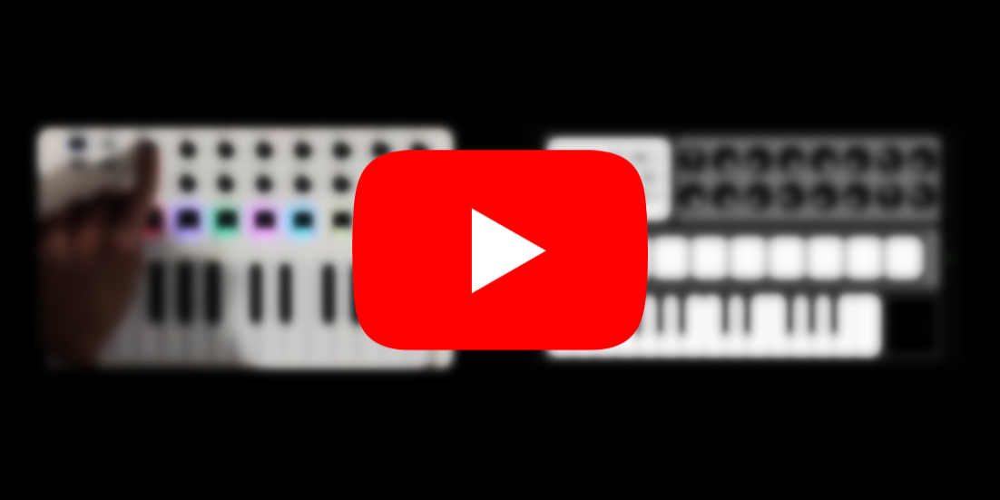
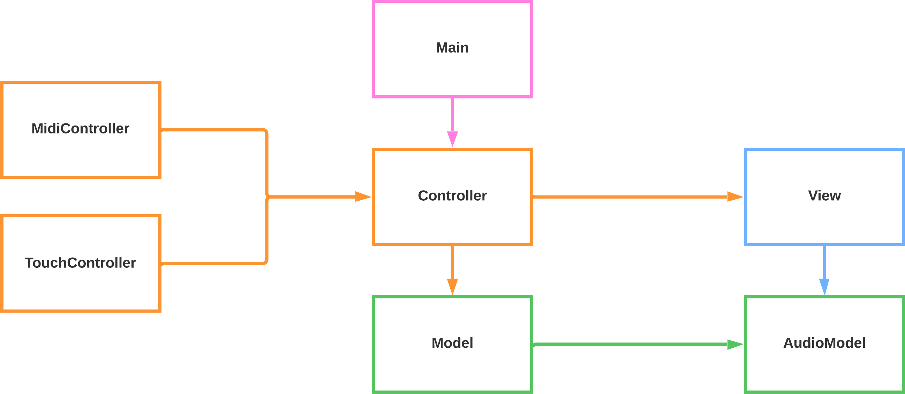
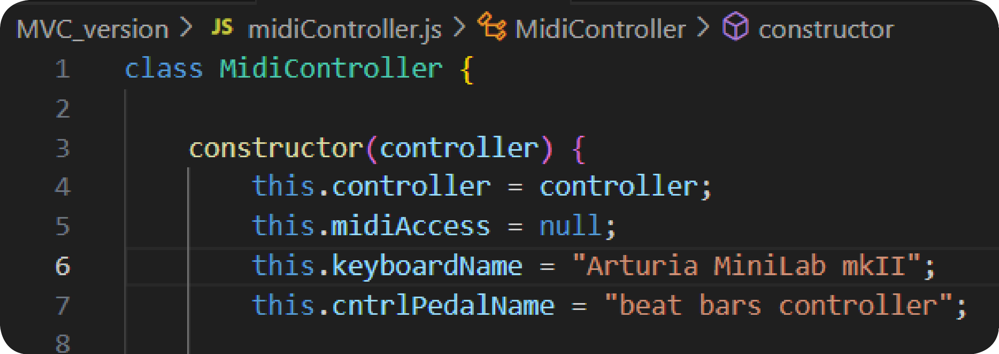

# MiniLab 🎹 
**Evaluation of 30 cum laude.**

This is a project developed during the "Advanced Coding Tools And Methodologies" course in the Music Engineering program at the Polytechnic University of Milan. 

It is possible to try my project at [this page](https://angeloantona.github.io/MiniLabSynth/), and you can find a video demonstration clicking on the thumbnail below.

## User instructions

### Hardware configuration

The hardware required to use all the functionalities of this project includes:
* **Arturia MiniLab MKII** &rarr; The project was specifically created for the Arturia MiniLab MKII. It's just a small MIDI controller with no integrated functions except for sending MIDI signals as output. However, it has the advantage of having many MIDI parameters that can be mapped, which has proven to be very useful for the completion of this project. It's possible to map the device's outputs by applying [this preset](ReadmeResources/Preset.minilabmk2) using the Arturia Midi Control Center app available [here](https://www.arturia.com/support/downloads&manuals).
* **Sustain Pedal** &rarr; You can use any sustain pedal.
* **Control pedal adapter** &rarr; Typically, control pedals (volume pedals) have an analog output. I used [this adapter](https://beatbars.com/en/dual-to-midi.html) to convert that output into a MIDI signal.
* **Control Pedal** &rarr; You can use any control/volume pedal.

### Functionalities overview

My code implements a 'synthesizer' that allows playing rhythmically and harmonically rich songs even if you're a soloist. This goal is achieved through the use of various oscillators, an arpeggiator, and a set of percussion instruments. Sounds can be combined at will by the user, who can use standard presets or create their own and save them in the cloud (Firebase). 

More details are provided below.

#### **Main Display**
Allows you to select the active instruments. The available instruments are: 
* Arpeggiator;
* Synth1 (left part of the keyboard when the keyboard is split);
* Synth2 (left part of the keyboard when the keyboard is split).

For each instrument, you can modify the following options:
- the oscillator to be emitted by the instrument;
- whether the instrument should play in mono or be polyphonic;
- which MIDI commands the particular instrument should respond to (e.g., sustain, pitchWheel);
- the octave at which the instrument should sound.
By right-clicking on this section, it is possible to link the pressing of each of the first two knobs on the left on the midi keyboard to the setting of a preset of your choice. This way, it will be more convenient to change configurations while playing.

#### **Keyboard Split**
Allows you to split the keyboard in half, setting one instrument to the left and one to the right. It's possible to select whether the arpeggiator should also be split directly from the Main Display.

#### **Knobs Section**
The knobs make it easy to modify the parameters of the sounds emitted by the synth. Starting from the left and going through each column, the functions of the knobs are as follows:
* *General gains*:
    - *Instruments gain*: allows you to manage the overall volume of the instrumental part.
    - *Drum gain*: allows you to manage the volume of the drum.
* *LPF*: allows you to choose the cutoff frequency of the LPF.
* *HPF*: allows you to choose the cutoff frequency of the HPF.
* *Instrument delay time*: allows you to lengthen or shorten the time interval between one delay iteration and the next.
* *Instrument delay volume*: allows you to vary the volume of delay iterations. This way, you can create a delay or a reverb.
* *Two free knobs*: are left free for possible project updates.
* *Single instrument volume*: allows you to modify the volume of the individual instrument, in order to equalize the overall sound better.
* *Arp Knobs*:
    - *Arp volume*: allows you to set the volume of the arpeggiator.
    - *Arp time*: allows you to set the speed at which the arpeggio is executed.

    Each knob can be automated by mapping it to the control pedal. By right-clicking on any of the knobs, you can choose from the following options:
    - *No mapping*: the knob will not respond to the control pedal's movement.
    - *Direct mapping*: when the control pedal's value increases, the knob will increment the controlled parameter.
    - *Inverse mapping*: when the control pedal's value increases, the knob will decrease the controlled parameter.
#### **Login**
Allows you to access the login menu.

#### **DB interaction** 
It is the section in which the user can:
- left click on ↓ : use one of the previously saved plugins.
- right click on X : delete one of the previously saved plugins.
- left click on ↑ : save a new plugin.

#### Pitch Wheel
The pitch wheel is a parameter that does not have an on-screen indicator (since using it with a keyboard and mouse was practically impossible, as you couldn't click on two objects simultaneously), but it's very useful because it allows you to vary the frequency of one or more oscillators while playing, which, when combined with delay and LPF and HPF, allows you to achieve a very pleasant effect (see demonstration video). You can control it by sliding on the touch controller of the keyboard indicated in green.

## Project implementation details

### Overview of the code structure

In developing the project, I haven't used external libraries except for Firebase, which is useful for database management. The audio part has been implemented using the Web Audio API. 

Let's now take a look at the code structure:

#### **Main** 
The Main class handles the interaction between the lower level classes and the Firebase server. Inside it, instances of other classes are constructed, and login is managed. The main functionalities implemented through this class are:
* *Initialization and Controller Setup* &rarr; The script sets up various controllers (AudioModel, Model, View, Controller, MidiController, TouchController) for managing different aspects of the application.
* *Firebase Integration* &rarr; The script initializes Firebase with specific configuration parameters (API keys, domain, etc.). The Firestore database (db) and Firebase Authentication service (auth) are set up for data storage and user authentication.
* *User Authentication* &rarr; Functions like logOut, onAuthStateChanged, and loginWithMail manage user authentication states. Users can log in with email and password, and their authentication state changes are monitored to load appropriate data.
* *Data Retrieval and Management* &rarr; Functions getDefaultPresets and getUserPresets retrieve preset data from Firestore. pushNewUserPreset and deletePreset allow adding and deleting user-specific presets in the Firestore database.

#### **MidiController**
The MidiController class acts as a bridge between MIDI hardware inputs and the software logic of the application. It interprets MIDI messages from the keyboard and the control pedal, translating them into actionable commands or data. The main functionalities that this class manages are:
* *MIDI Setup*:
    * initializeMIDI &rarr; Requests access to MIDI devices and, upon success, calls setupMIDIInput to configure MIDI input handling.
    * setupMIDIInput &rarr; Iterates over available MIDI input devices and sets up event handlers for the specified keyboard and control pedal.
* *Handling MIDI Messages*:
    * handleKeyboardMIDIMessage &rarr; Processes MIDI messages received from the keyboard. It interprets different types of MIDI messages such as Pitch Bend, Control Change, Note On, and Note Off.
    * handlecntrlPedalMIDIMessage &rarr; Processes MIDI messages from the control pedal. It handles specific control changes based on the pedal's input.
#### **TouchController**
TouchController provides a touch-based interface for interacting with various elements of the synthesizer. It translates user actions like clicking and dragging on screen elements into meaningful commands that are sent to the controller. This class manages the following functions:
* *Touch Interaction* &rarr; The methods attachKeysEventListeners, attachPadsEventListeners, attachDisplayButtonsEventListeners and attachDisplaySplitEventListener listen for mouse down, up, and leave events and send the corresponding commands to the controller class.
#### **Controller**
The Controller class serves as an intermediary between the other controllers (midi and touch input), the model (data and logic) and the view (UI). The mediation between the different classes consists of:
* *Preset Management* &rarr; setPreset changes the current preset based on user selection. synchronizeKnobs updates the knob elements on the UI to reflect the current state of the model.
* *Instruments Handling* &rarr; handleNoteOn and handleNoteOff manage the behavior when musical notes are played or stopped. This includes handling for different instruments like keys, bass, and arpeggio (arp). handleSustain manages sustain pedal effects for notes. Functions like handlePadOn, handlePadOff, handleControlChangeEvent, and handleWheel handle various user interactions with pads, control changes, and modulation wheels. handleArp toggles the arpeggiator and updates the interface accordingly.
* *Instrument Configuration* &rarr; shiftOctave, waveformChanger, splitManager, turnOn, flipWheel, flipMono, flipSustain are used to modify settings of the instruments like octave shifting, waveform changing, mono/polyphonic modes, and sustain settings.
* *MIDI and Preset Mapping* &rarr; handleMidiPresetChange and handleMidiMappingPresetChange manage changes in MIDI presets and mappings.
* *Rendering and Display Updates* &rarr; renderAll is a comprehensive function that updates the entire view based on the current state of the model. It updates various components like volume indicators, oscillator types, active indicators, and more.
#### **View**
View class is focused on the visual aspects of the application. It manages the dynamic updating of UI components based on user interactions and audio processing events. This includes visual feedback on controls like knobs and buttons, visualizations of audio signals, and general UI theming and layout adjustments. This class manages:
* *Knob Interaction* &rarr; rotateKnob updates the visual representation of a knob element based on the rotation value, reflecting changes in settings like volume or filter cutoff.
* *Display Updates* &rarr; functions like updateDisplayOctave, renderActiveIndicator, showOscillatorType, flipButton, updateSplitDot and updateDisplayVolumeIndicator update various display indicators (es. the display of the current octave for an instrument, the current type of oscillator,...). 
* *Amplitude Visualization* &rarr; drawAmplitudePlot and animateAmplitudePlot are responsible for creating and animating an amplitude plot on the canvas. These methods visualize the audio signal's amplitude over time.
*  *User Interface Color Theming* &rarr; interfaceColorGradient adjusts the color scheme of various interface elements like knobs, pads, and buttons based on the audio signal's properties.
#### **Model** 
The Model class acts as the central repository for the application's state, handling the logic for audio parameters, user interactions, and interface changes. The main functionalities that this class manages are:
* *Preset Management* &rarr; setPresets and setPreset are used to manage presets. getPresetNames provides a list of available preset names. handleMidiPresetChange changes presets based on MIDI input.
* *Instrument Settings* &rarr; Methods like flipSplit, flipMono, flipSust, and flipWheel toggle different modes for instruments (e.g., split mode, mono/polyphonic mode, sustain, wheel control). setWaveform updates the waveform type for different instruments based on user selection.
* *Knob and Control Pedal Handling* &rarr; updateKnobLevel and handleControlChangeEvent manage changes in knob levels and control changes from the MIDI or touch input. connectPedalKnobs links control pedals to specific knob functions.
* *Audio Parameter Updates* &rarr; refreshAudioParameters updates the audioModel with the current state of various controls like gain, filter frequencies, delay settings, etc.
* *Note Handling for Instruments* &rarr; Methods like handleNoteOn, handleNoteOff, handleBassOn, handleBassOff, and related methods manage the playing and stopping of notes for keys, bass, and arpeggiator. deleteAllNotes and deleteAllSustainedNotes are used to stop all currently playing or sustained notes.
* *Arpeggiator Control* &rarr; handleArpeggioOn, handleArpeggioOff, playArpSequence, and handleArpSustain control the behavior of the arpeggiator, including note playing and sustaining.
* *Drum Pad Handling* &rarr; handlePadOn and handlePadOff manage interactions with drum pads, triggering different drum sounds.
#### **AudioModel**
AudioModel acts as the audio engine for the application, generating and manipulating sound based on user interactions and control settings. It provides a wide range of functionalities for synthesizing musical notes, applying audio effects like filters and delays, and generating drum sounds. Going into more detail, the main functionalities of this class are:
* *Gain Control* &rarr; Methods like setMainGain, setInstGain, setDrumGain, setKeyGain, setBassGain, and setArpGain control the volume levels of different audio sources.
* *Filter and Delay Configuration* &rarr; setLowPassFilterFrequency and setHiPassFilterFrequency configure the frequencies of low-pass and high-pass filters for keys and bass. setDelayTime and setDelayFeedback adjust the delay time and feedback amount for keys and bass delay effects.
* *Oscillator Configuration* &rarr; setNoteOscillator sets the type of waveform to be used for note oscillators.
* *Note Handling and Sound Generation* &rarr; playNote creates an OscillatorNode and GainNode to play a musical note. It sets the oscillator frequency based on the note and instrument type and connects it to appropriate audio nodes. stopNote gracefully fades out and stops a playing note.
* *Drum Sounds* &rarr; playKick, playSnare, playClosedHiHat, and playCrashCymbal generate various drum sounds using techniques like white noise generation and filter application.
* *Amplitude Analysis* &rarr; getAmplitude analyzes the audio signal to calculate the amplitude for visualization purposes.

The informations described above are available also in the chart provided [here](ReadmeResources/similUML.pdf).

### Audio Chain

The audio chain is constructed in the AudioModel class following the scheme represented below:

.png)

### Database

As previously mentioned, this application uses the Firebase library to communicate with the Firebase server in order to download existing presets and save new ones. The database allows for two types of access:
* **Anonymous Access**: Users who access anonymously can use all the default presets but cannot save or delete new ones.
* **Email and Password Access**: Users who identify themselves via email and password have complete access (write, read, and delete) to only the presets they have created. No user can access the presets created by another user.

The access rules specified above have been implemented directly in Firebase to prevent unauthorized access to the database.

### Possible improvements
One aspect that could be easily implemented is the selection of the MIDI controller through a choice menu, allowing the user to choose which MIDI controller to use for the keyboard and control pedal. This is a relatively straightforward process because it would involve modifying the content of the variable in the midiController class based on the input value from the choice menu (as shown in the code snippet below).

Once the MIDI controller is selected, ideally, a simple guided configuration should begin where the user is shown a programmable element of the interface using an arrow (e.g., knob1) and asked to operate the control on their MIDI device that they want to map to that function. This preset could then be saved on Firebase (in the user's folder once they have logged in) so that the user doesn't have to configure it every time.

Unfortunately, I haven't been able to develop this last objective due to a lack of time, but it's certainly something I'll work on.

# Additional information

## Status
| Main Objectives                                                            | State           |
| ---------------------------------------------------------------------------|:---------------:|
| Integration of Keyboard and Pad Sounds                                     | :green_circle:  |
| Development of a Mini Amplitude Display                                    | :green_circle:  |
| Implementation of Independent Volume Controls for Each Instrument          | :green_circle:  |
| Support for MIDI Keyboard Input                                            | :green_circle:  |
| Inclusion of Sustain and Control Pedal MIDI Inputs                         | :green_circle:  |
| Implementation of an Arpeggiator Function                                  | :green_circle:  |
| Configurable Control Pedal                                                 | :green_circle:  |
| Customizable Knob and Button Presets                                       | :green_circle:  |
| Keyboard split                                                             | :green_circle:  |
| Creation of Sound Presets                                                  | :green_circle:  |
| Firebase Integration for Preset Management                                 | :green_circle:  |
| Configurable with any keyboard                                             | :red_circle:    |

| Sound effects                             | State           |
| ----------------------------------------- |:---------------:|
| Implementation of a Frequency Wheel       | :green_circle:  |
| Implementation of Reverb Effect           | :green_circle:  |
| Implementation of Delay Effect            | :green_circle:  |
| Low-Pass Filter (LPF) Feature             | :green_circle:  |
| High-Pass Filter (HPF) Option             | :green_circle:  |

### Legend
- :green_circle: Implemented
- :yellow_circle: Implementing
- :red_circle: Not Implemented

## About me
| LinkedIn                                                   | Email                         |
| ---------------------------------------------------------- |:-----------------------------:|
| [Angelo Antona](https://www.linkedin.com/in/angeloantona/) | angelo.antona@mail.polimi.it  |
